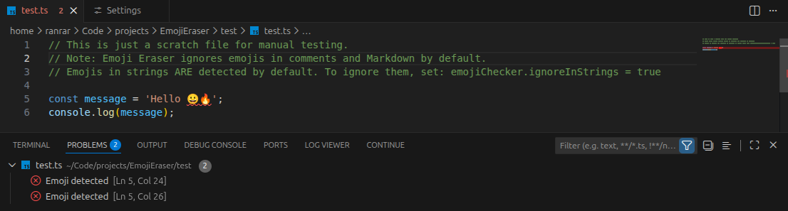
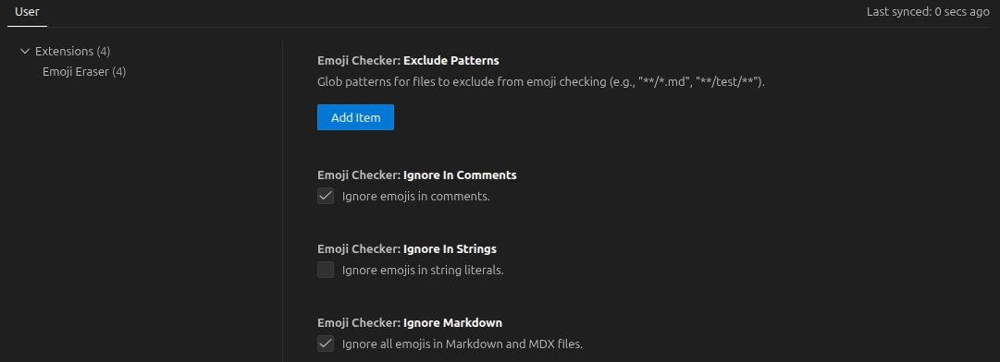

# Emoji Eraser

Emoji Eraser highlights emojis as diagnostics and provides a command to remove all emojis from the current file.

## Screenshots

### Diagnostics in Action


### Extension Settings


## Features

- 🔍 Shows a diagnostic on each detected emoji.
- ⚙️ Configurable diagnostic severity (Error, Warning, Information, Hint).
- 💡 **Quick Fix**: Click the lightbulb to remove individual emojis.
- 📝 Separate options to ignore emojis in comments, strings, and Markdown files.
- 🎯 File exclusion patterns to skip specific files or folders.
- 🗑️ Command: **Emoji Eraser: Remove all emojis** from the current file.

## Settings

- **`emojiChecker.ignoreInComments`** (boolean, default: `true`)
  - Ignores emojis in code comments (best-effort parsing for common languages).

- **`emojiChecker.ignoreInStrings`** (boolean, default: `false`)
  - Ignores emojis in string literals (`'...'`, `"..."`, `` `...` ``).
  - Includes Python triple-quoted strings.

- **`emojiChecker.ignoreMarkdown`** (boolean, default: `true`)
  - Ignores all emojis in Markdown and MDX files.

- **`emojiChecker.excludePatterns`** (array, default: `[]`)
  - Glob patterns for files to exclude from emoji checking.
  - Example: `["**/*.md", "**/test/**", "**/node_modules/**"]`

- **`emojiChecker.severity`** (string, default: `"Error"`)
  - Options: `"Error"`, `"Warning"`, `"Information"`, `"Hint"`
  - Controls the diagnostic severity level shown in the editor.

## Usage

1. Open the project in VS Code.
2. Press **F5** to launch an Extension Development Host.
3. Open a file containing emojis (e.g., `test/sample.txt`).
4. See diagnostics on detected emojis.
5. **Quick Fix**: Click the 💡 lightbulb icon on an emoji diagnostic and select "Remove this emoji".
6. **Bulk Remove**: Run **Emoji Eraser: Remove all emojis** from the Command Palette to remove all emojis at once.

## Examples

### Default behavior (both ignore settings enabled)
Only emojis in plain code/text are highlighted:
```javascript
const x = "Hello 😀";  // ← emoji ignored (in string)
// Nice work! 🔥       // ← emoji ignored (in comment)
const y = 🎉;          // ← emoji DETECTED (plain code)
```

### Detect emojis in strings only
Set `"emojiChecker.ignoreInComments": true` and `"emojiChecker.ignoreInStrings": false`:
```javascript
const x = "Hello 😀";  // ← emoji DETECTED (in string)
// Nice work! 🔥       // ← emoji ignored (in comment)
```

### Detect all emojis everywhere
Set both to `false`:
```javascript
const x = "Hello 😀";  // ← emoji DETECTED
// Nice work! 🔥       // ← emoji DETECTED
```

## Development

### Building locally
```bash
npm install
npm run compile
```

### Testing
Press **F5** in VS Code to launch the Extension Development Host.

### Packaging
```bash
npm install -g @vscode/vsce
vsce package
```

## CI/CD

This extension uses GitHub Actions for automated builds and publishing:

- **CI Build**: Runs on every push to `main` and all pull requests
  - Compiles TypeScript
  - Packages the extension
  - Uploads `.vsix` artifact

- **Version Bump**: Manual workflow for releasing new versions
  - Choose patch/minor/major version bump
  - Updates `package.json` version
  - Creates git tag and GitHub release
  - Automatically triggers publish workflow

- **Auto-Publish**: Triggered on GitHub releases
  - Publishes to VS Code Marketplace
  - Attaches `.vsix` to the release

### Version Management

This project follows [Semantic Versioning](https://semver.org/):

- **Patch** (0.0.x): Bug fixes, minor changes
- **Minor** (0.x.0): New features, backwards compatible
- **Major** (x.0.0): Breaking changes

#### Releasing a new version

**Option 1: Automated (recommended)**
1. Go to GitHub Actions → "Version Bump" workflow
2. Click "Run workflow"
3. Select version bump type (patch/minor/major)
4. GitHub automatically:
   - Bumps version in `package.json`
   - Creates git tag
   - Creates GitHub release
   - Publishes to VS Code Marketplace

**Option 2: Manual**
```bash
# Bump version locally
npm run version:patch   # or version:minor, version:major

# Push changes and tags
git push
git push --tags

# Create release manually on GitHub
```

### Setup for Publishing

To enable automatic publishing, add a repository secret:

1. Create a Personal Access Token at https://marketplace.visualstudio.com/manage
2. Add it as `VSCE_TOKEN` in your GitHub repository secrets

## Changelog

See [CHANGELOG.md](CHANGELOG.md) for a detailed history of changes.

## License

MIT
